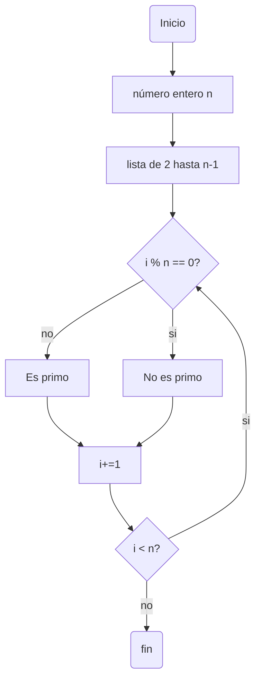
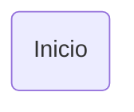

# Repo_2
## Resultados reto #3Reto no. 3
>1.Plantear el algoritmo para obtener los números primos hasta n, usando pseudocódigo y diagramas de flujo.

- Paso 1. Hacer una lista de numeros naturales desde 2 hasta n-1
- Paso 2. Repetir para cada numero i de la lista 
- Paso 2.1 Dividir por i cada numero de la lista, excepto si i mismo
- Paso 2.2 Si el resultado de la division es un numero natural se descarta el dividendo
- Paso 2.3 Sino, se mantiene en la lista

### Pseudocódigo
n : entero
i : entero 
inicio 
  i :=2
  Mientras (i<n) hacer
 si el modulo(n,i)== 0 
    escribir ("no es primo") 
 sino 
    escribir ("es primo")
  i := i + 1
Fin
### Diagrama de flujo 

>2.Revise el procedimiento matemático para hallar raíces cuadradas (son divisiones y restas), plantee el algoritmo en pseudocódigo y en diagrama de flujo.

1. hacer lista de divisores primos de n
2. Dividir el primer n por item de la lista
3. dividir el cociente por el mismo item
4. Repetetir hasta que el resultado no sea divisible por el mismo primo
5. Pasar con el siguiente primo y dividir
6. Si se puede continuar
7. sino pasar al siguiente primo
8. repetir hasta que el dividendo sea uno
9. tomar todos los divisores y multiplicarlos entre si
10. Agrupar los que se puedan expresar como potencia de 2
11. Sino se mantiene igual
12. A los numeros con potencia de 2 se les remueve la potencia y se multiplican entre si
13. sino se escriben dentro de una raiz
14. Fin

### Pseudocódigo

###Diagrama de flujo

>3.Cree un repositorio en github en donde muestre el desarrollo de la actividad y comparta el enlace por el canal de slack reto_3.

