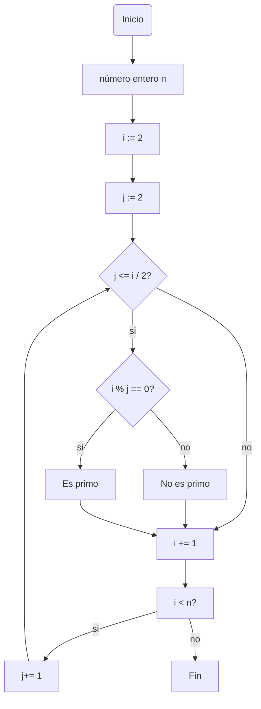

# Repo_2
## Resultados reto #3
>1.Plantear el algoritmo para obtener los números primos hasta n, usando pseudocódigo y diagramas de flujo.

### Pseudocódigo
```pseudocode
n : entero
i : entero 
j : entero
inicio 
i :=2
Mientras (i< n) hacer
  j:=2
  Mientras (j<=i/2) hacer
   si el modulo(i,j) ==0 
      escribir  ("j no es primo") 
   sino 
      escribir ("j es primo")
   j := j + 1
i := i + 1
Fin
```
### Diagrama de flujo 

>2.Revise el procedimiento matemático para hallar raíces cuadradas (son divisiones y restas), plantee el algoritmo en pseudocódigo y en diagrama de flujo.

1. hacer lista de divisores primos de n
2. Dividir n por el primer item i de la lista
3. dividir el cociente por el mismo item
4. Repetetir hasta que el resultado no sea divisible por el item
5. Pasar con el siguiente item y dividir
8. repetir hasta que el dividendo sea uno
9. tomar todos los divisores y multiplicarlos entre si
10. Agrupar los que se puedan expresar como potencia de 2
11. Sino se mantiene igual
12. A los numeros con potencia de 2 se les remueve la potencia y se multiplican entre si
13. sino se escriben dentro de una raiz
14. Fin

### Pseudocódigo
```pseudocode
n : entero
i : entero
lista de divisores primos para n
  Mientras (n%i) != 0 hacer

```
###Diagrama de flujo


