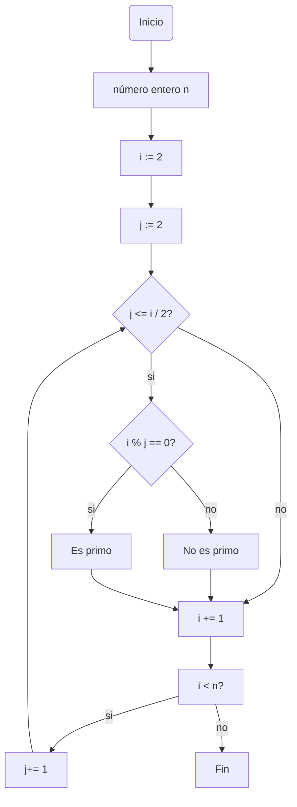
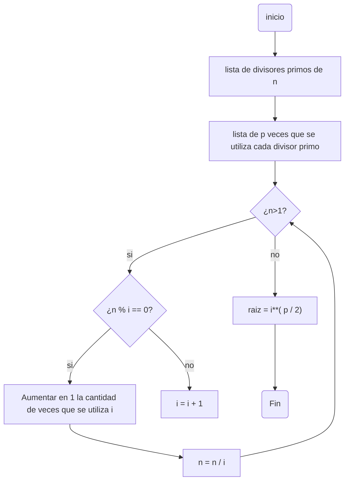

# Repo_2
## Resultados reto #3
>1.Plantear el algoritmo para obtener los números primos hasta n, usando pseudocódigo y diagramas de flujo.

### Pseudocódigo
```pseudocode
n : entero
i : entero 
j : entero
inicio 
i :=2
Mientras (i< n) hacer
  j:=2
  Mientras (j<=i/2) hacer
   si el modulo(i,j) ==0 
      escribir  ("j no es primo") 
   sino 
      escribir ("j es primo")
   j := j + 1
i := i + 1
Fin
```
### Diagrama de flujo 

>2.Revise el procedimiento matemático para hallar raíces cuadradas (son divisiones y restas), plantee el algoritmo en pseudocódigo y en diagrama de flujo.

### Pseudocódigo
```pseudocode
Inicio
n : entero
i : entero
p : entero 
lista de divisores primos de n (i,...)
lista de p veces que se utiliza cada divisor primo

 Mientras (n > 1)
        si (n % i) == 0
            Aumentar en 1 la cantidad de veces que se utiliza i
            n = n / i
        sino
         i = i + 1
raiz = i**( p / 2), por cada divisores primo que se utilizo
Fin
```
###Diagrama de flujo



